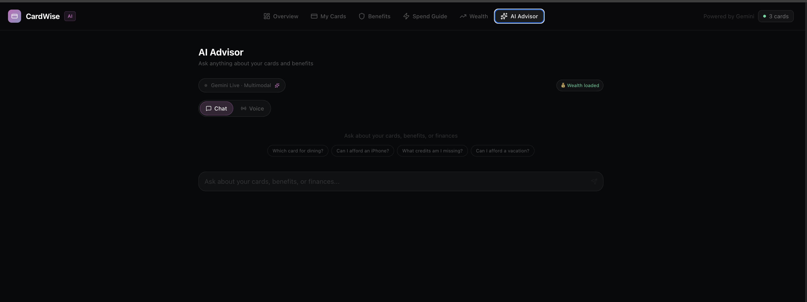
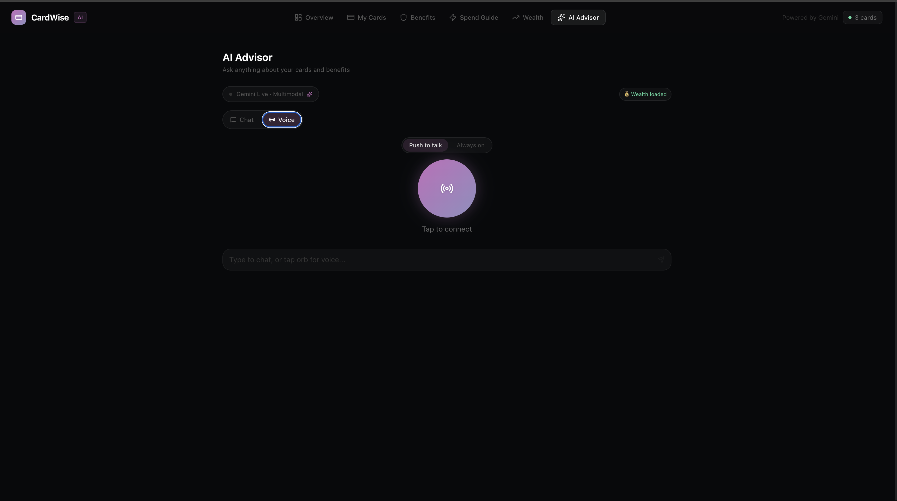
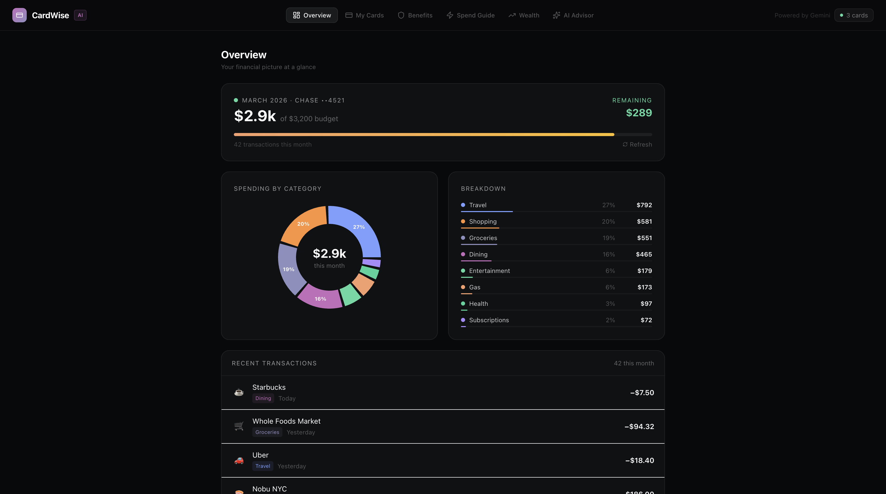
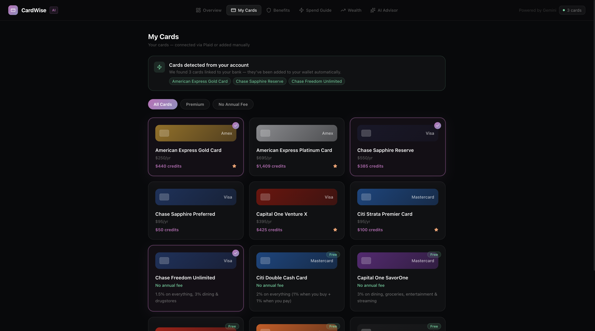
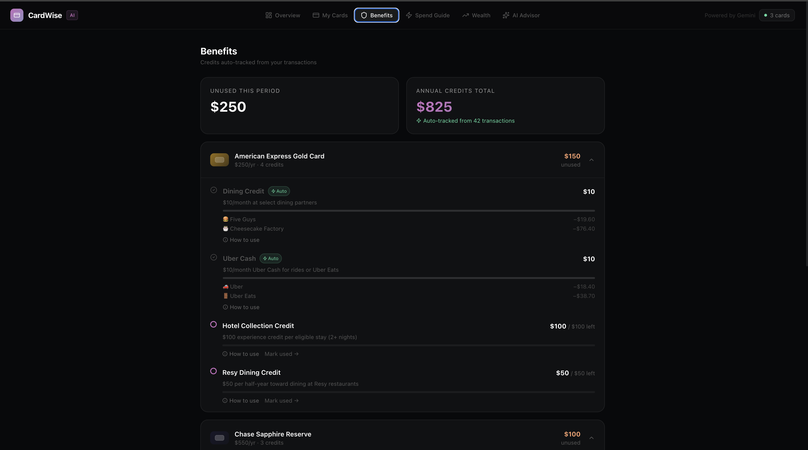
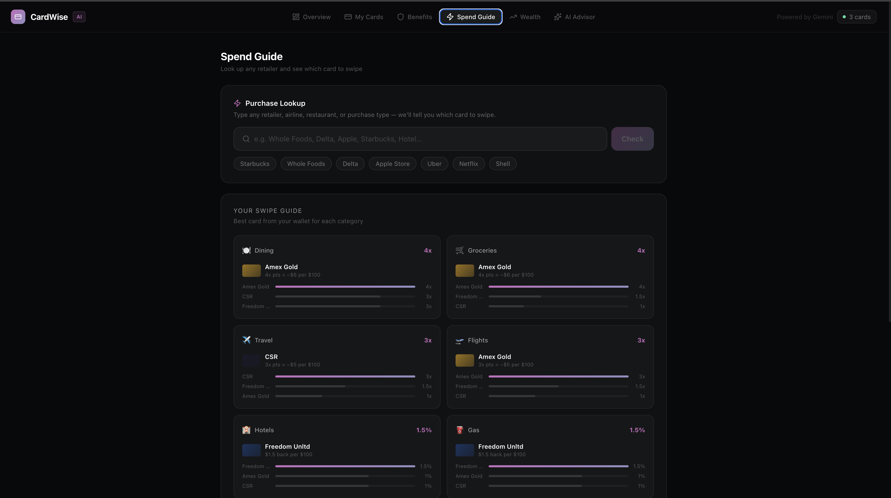
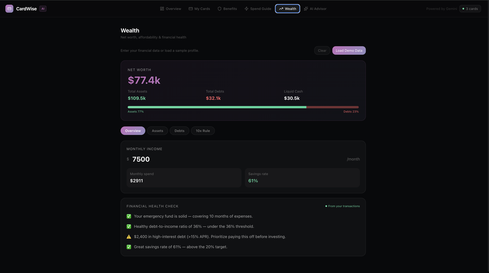

# CardWise AI

**Hackathon project — GDG NYC 2026**

Team member: Hoang Do

An AI-powered personal credit card and financial advisor built with the **Gemini Live API (Native Audio 2.5)**. CardWise tells you which card to swipe, whether you can afford a purchase, and tracks your benefits — all through natural conversation.

🌐 **Live demo:** https://cardwise-frontend-382226112053.us-central1.run.app

---

## Features

### 💬 AI Advisor — Chat & Voice
Talk to your personal card advisor in real-time. Switch between text chat and live voice mid-conversation — the agent remembers everything.

- **Chat mode** — Type questions, get streaming text responses powered by Gemini 2.5 Flash
- **Voice mode** — Hold the orb to speak (push-to-talk), hear Gemini's response through your speakers
- **Camera mode** — Share a live camera frame (e.g. point at a receipt) and get instant analysis
- Conversation history persists across mode switches




---

### 📊 Dashboard — Financial Overview
A glanceable summary of your card portfolio, upcoming credits, and monthly rewards.

- Total rewards earned and credits remaining
- Quick links to ROI calculator and spend guide
- Plaid integration for real transaction data



---

### 💳 My Cards — Card Picker
Browse and select from a database of premium cards (Amex Gold, Chase Sapphire Reserve, Venture X, and more).

- Toggle cards on/off to build your wallet
- See annual fee, earning rates, and total credit value at a glance
- Plaid-detected cards are auto-selected



---

### 🛡️ Benefits Tracker — Auto Credit Tracking
Never let a credit expire unused. CardWise auto-detects when you've used a benefit from your linked transactions.

- Monthly and annual credits tracked per card (dining, travel, streaming, etc.)
- Progress bars show how much of each credit you've used
- Manual override if Plaid isn't connected



---

### ⚡ Spend Guide — "Which card should I swipe?"
Look up any merchant or category and instantly see which card earns the most.

- Search retailers, restaurants, airlines — powered by a curated merchant database
- ROI Calculator shows annual net value per card based on your actual spending profile
- Adjustable spending sliders for dining, groceries, travel, gas, and more



---

### 💰 Wealth Tracker — Net Worth & Affordability
Track your financial health and get a clear answer on whether you can afford a purchase.

- Add assets (checking, savings, investments, 401k, real estate) and liabilities (loans, credit card debt)
- Net worth, liquid assets, and debt-to-income ratio at a glance
- **10x Rule affordability check** — enter any purchase amount and see:
  - ✅ Comfortable (liquid assets ≥ 10× purchase)
  - ⚠️ Caution (3–10×)
  - ❌ Not now (<3×)



---

### 🧾 Receipt / Media Analysis
Upload a photo or video of a receipt and Gemini tells you which card you should have used and why.

- Extracts merchant, amount, and spending category automatically
- Recommends the optimal card from your wallet
- Supports images and video (via Gemini Files API)

---

## How the AI advisor works

The AI Advisor uses **Gemini Live API** with bidirectional audio streaming over a WebSocket connection:

```
Browser ──── WebSocket ────▶ FastAPI backend ──── Gemini Live API
   ▲  PCM16 audio @ 16kHz                              │
   │  text / image frames                              │ PCM16 audio @ 24kHz
   └──────────────────────────────────────────────────┘
```

Key technical decisions:
- **Push-to-talk with explicit activity control** — `AutomaticActivityDetection` disabled; `ActivityStart`/`ActivityEnd` signals wrap each turn for reliable multi-turn support
- **Gapless audio playback** — PCM16 chunks scheduled using `AudioContext.createBufferSource().start(scheduledTime)` with a tracked `nextPlayTime` pointer
- **Audio resampling** — Browser captures at 44100 Hz; resampled to 16000 Hz via linear interpolation before sending to Gemini
- **Multi-turn fix** — `session.receive()` exits after each `turn_complete`; the backend loops it in `while True` to keep receiving across turns
- **Context continuity** — Prior chat turns are injected as context when switching to voice mode so the conversation continues naturally

---

## Tech stack

| Layer | Technology |
|---|---|
| Frontend | Next.js 16, TypeScript, Tailwind CSS |
| Backend | FastAPI (Python 3.11) |
| AI models | Gemini 2.5 Flash, Gemini Live Native Audio 2.5 (`gemini-2.5-flash-native-audio-preview-12-2025`) |
| Deployment | Google Cloud Run (both services) |
| Integrations | Plaid (transactions), Google GenAI SDK |

---

## Running locally

### Prerequisites
- Python 3.11+
- Node.js 20+
- A [Gemini API key](https://aistudio.google.com/app/apikey) (linked to a billing-enabled Google Cloud project)

### Backend
```bash
cd backend
python -m venv venv && source venv/bin/activate
pip install -r requirements.txt
cp .env.example .env
# Edit .env and set GEMINI_API_KEY=your_key_here
uvicorn main:app --reload --port 8000
```

### Frontend
```bash
cd frontend
npm install
echo "NEXT_PUBLIC_API_URL=http://localhost:8000" > .env.local
npm run dev
```

Open [http://localhost:3000](http://localhost:3000).

---

## Deployment (Google Cloud Run)

```bash
# Backend
cd backend
gcloud run deploy cardwise-backend \
  --source . --region us-central1 \
  --allow-unauthenticated --port 8080

# Set the API key secret
gcloud run services update cardwise-backend \
  --set-env-vars GEMINI_API_KEY=your_key_here \
  --region us-central1

# Frontend
cd frontend
gcloud run deploy cardwise-frontend \
  --source . --region us-central1 \
  --allow-unauthenticated --port 3000 \
  --set-build-env-vars NEXT_PUBLIC_API_URL=https://your-backend-url
```

---

## Hackathon track

Built for the **Live Agent** track — leverages Gemini Live API for real-time, multi-turn voice + vision conversations that maintain full context across turns and input modalities.
